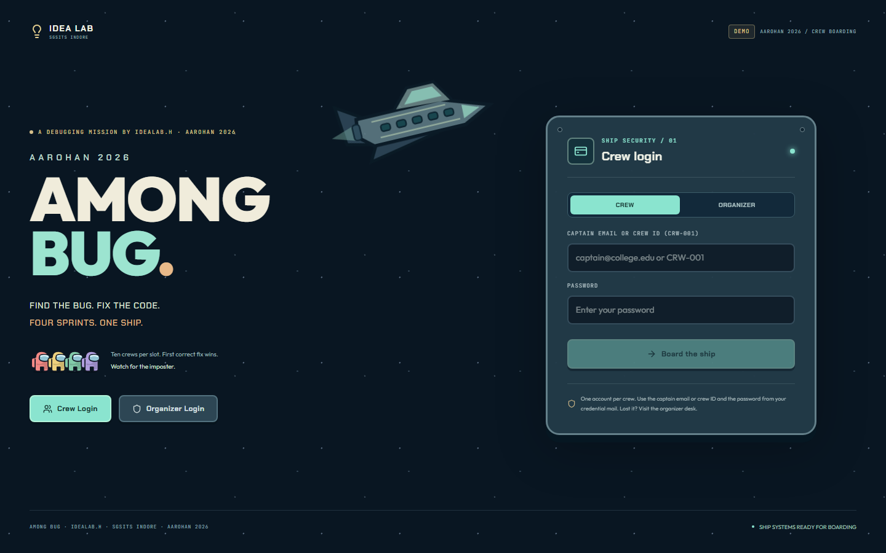
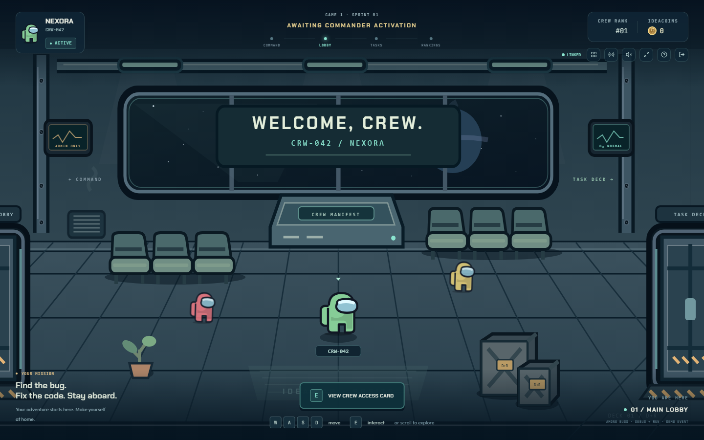
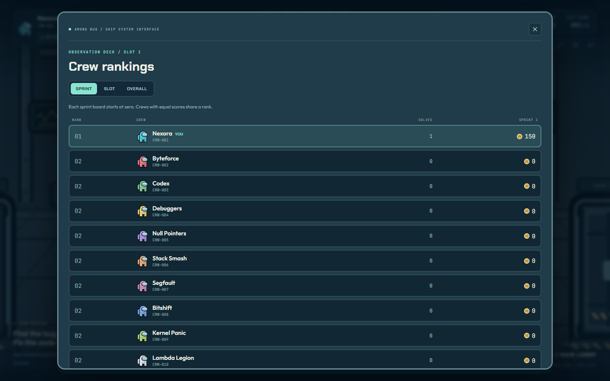
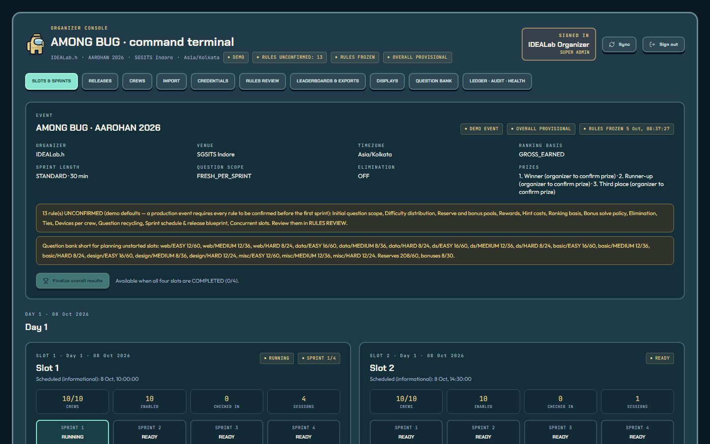
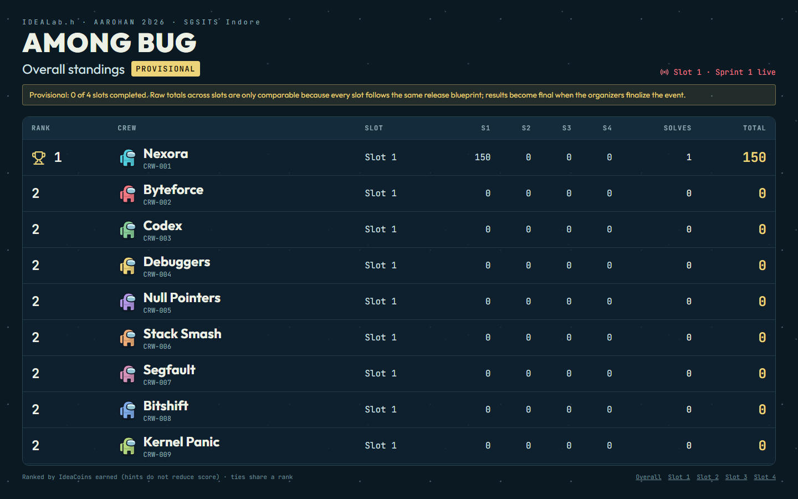

# AMONG BUG

An Among-Us-themed debugging competition platform for **IDEALab.h · AAROHAN 2026 · SGSITS Indore**.

The format is **2 days × 2 slots × 4 sprints**, and every crew plays in exactly one slot. Crews
board an explorable spaceship, solve flag problems from the IDEALab.dev bank at six domain stations, and race for
IdeaCoins. Organizers import crews, send credentials, start each sprint explicitly, release
questions from the bank (initial sets, top-ups, bonuses), and finalize results. Projectors show live sprint, slot and overall boards.

| Landing | Ship lobby + HUD | Rankings |
|---|---|---|
|  |  |  |
| **Organizer console** | **Projector (overall, provisional)** | |
|  |  | |

Screenshots regenerate with `node e2e/tools/shots.mjs docs/screenshots` against `npm run dev`.

| Part | Stack | Purpose |
|---|---|---|
| `web/` | React 19, TypeScript, Vite, Tailwind v4, motion, Monaco, Socket.IO client | Landing (Crew Login / Organizer Login), access card, playable ship + HUD, question workspace, organizer console (`/command`), projector screens (`/display/...`) |
| `server/` | Node 20+, Fastify 5, PostgreSQL (`pg`), Socket.IO, zod, exceljs, nodemailer | `/api/v1` (+ OpenAPI), sessions, imports, credentials, slot/sprint lifecycle, release scheduler, first-solve scoring, ledger, boards, exports, worker |
| `runner/` | Node HTTP service + CPython | Isolated execution of participant JavaScript / Python; the scoring API never spawns processes |
| `samples/` | CSV / XLSX / JSON | Team and question import samples, including an invalid fixture |
| `docs/` | | Runbook, API, decisions / rules, import formats, demo access, content review |

---

## Future context (read this first)

This section is the maintained handoff for whoever works on the repo next (human or AI).
Keep it current when behaviour changes.

### History

1. **v1 (commit `a2914de`):** a two-game / two-sprint event (Game 1 = Day 1, Game 2 = Day 2) with
   self-registration, per-day eligibility, elimination after each sprint, and reservable imposter
   problems.
2. **v2 (current):** rebuilt to the **four-slot brief** (`AMONG_BUG_Four_Slots_Claude_Code_Prompt.md`,
   supplied by the organizers, not stored here). It supersedes v1 completely. The schema, services,
   API (`/api` → `/api/v1`), seed, tests and UI were rewritten. Conflicts and every rule default:
   [`docs/DECISIONS.md`](docs/DECISIONS.md).

### The model in one screen

- **Structure:**
  - `event` (one row; `rules` jsonb + `rule_confirmations`) → `event_day` (2) → `slot` (4) →
    `sprint` (4 per slot).
  - `team` → `slot_enrollment`, which is unique per team: one slot per crew. It caches wallet,
    earned, spent and score, and is the scoring identity.
- **Content (question bank):**
  - `question` → `question_version` (DRAFT → REVIEWED → PUBLISHED). The bank is the organizers'
    **IDEALab.dev** repository: 360 flag problems, 6 domains (`core_compute`, `cryptography`,
    `data_decypher`, `maker`, `recon`, `web`), 25 easy / 20 medium / 15 hard each. Snapshot in
    `server/src/content/idealab/` (`SOURCE.json` = commit); converter `content/idealab.ts`.
  - **GitHub sync** (`services/sync.ts`): preview → commit by repository id and content hash
    (NEW / CHANGED / UNCHANGED); changed questions get a new version (DRAFT, or PUBLISHED only when
    the organizer ticks it). Released instances keep their version.
  - `question_version` (migration 003) adds `runtime` (python / shell / sql / json), `board`
    (evidence), `hints` (ladder, bought in order; `hint_purchase.level`) and `source`.
  - **Workspaces:** BASIC / DATA (Python; hidden setup + check via stdin, numpy / pandas /
    matplotlib, plots returned as PNG), SHELL (server-side virtual shell, `services/shell.ts`),
    SQL (SQLite in the runner), JSON (server-side compare), EVIDENCE (board + flag), WEB (preview).
    Job building lives in `services/runtimes.ts`; dispatch in `services/runs.ts`.
  - Hidden-check secrecy: the flag literal in a check is replaced by a per-run nonce that the
    server swaps back only in output; self-contained checks (maker_41–60) are output-gated.
- **Scoring:**
  - `submission` → `solve_award` (unique per instance + generation) → append-only `coin_ledger`
    (`slot_id`, `sprint_id`).
  - `hint_purchase` is unique per crew + instance.
  - Sprint score = ledger rows of that sprint, so each sprint board starts at zero. Slot
    cumulative = all rows. Overall = across slots (provisional until `finalizeEvent`).
  - Metric: GROSS_EARNED (default) or NET_COINS, in `services/ranking.ts`. It is the ONE scoring
    rule used everywhere.
- **Lifecycle (organizer-driven, `services/lifecycle.ts`):**
  - Roll call: attendance (`team.checked_in_at`) enables crew login (rule `attendanceGatesLogin`).
  - `openSlot` (kick-in, `slot.opened_at`): crews of that slot may board and roam; nothing is solvable yet.
  - `preflight` (blocks until the slot is open) → `startSprint` (releases INITIAL, freezes rules).
  - The worker closes at the DB deadline (`closeSprint`: expires fresh questions, cancels
    unreleased releases, freezes a snapshot).
  - Then the next `startSprint` → … → `finalizeSlot` → `finalizeEvent`.
  - Pause / resume shift the deadline. Only one slot runs at a time.
- **Releases (`services/bank.ts`, `services/releases.ts`):** rule `questionScope` = SLOT_POOL
  (default): released questions stay active for the whole slot and expire when its last sprint
  closes.
  - **Initial set** per slot (`buildSlotPlan`): 7 easy / 5 medium / 3 hard per domain (rule
    `initialPerDomain`) = 90, released when Sprint 1 starts; editable before then (remove, add,
    rebuild with other counts).
  - **Stock** (`slotStock`): active / solved / planned vs target per domain × difficulty.
  - **Top up** (`topUp`) auto-picks back to target; **pick & release** (`releaseFromBank`) sends
    chosen bank questions, regular or BONUS, NOW or at the next sprint start.
  - **Reuse is allowed:** the picker prefers questions new to the slot, then the least used, then
    a deterministic per-slot order.
  - `releaseNow` stays the single idempotent release path (worker and organizers).
- **Content protection** (rule `protectContent`, default on; `web/src/lib/contentProtection.tsx`):
  crew screens block copy / cut / context menu / devtools and screenshot shortcuts, blur when
  focus is lost, hide on print, and carry a crew watermark. Best effort only.
- **People:**
  - Crews come only from CSV/XLSX import (`services/teams.ts`: preview → commit, stable `CRW-NNN`,
    never resets passwords).
  - Credentials only via explicit send (`services/mail.ts`: capture / smtp / none; `MAIL_SINK`).
  - Organizers: SUPER_ADMIN / OPERATOR / CONTENT_EDITOR permissions (`server/src/http.ts`).
  - Projectors: revocable display links → display-only cookie (`services/display.ts`).
- **Realtime:** a transactional outbox → LISTEN/NOTIFY → Socket.IO rooms (`slot:<id>` only for
  enrolled, enabled crews; `organizers`; `display`). Messages are hints; clients re-fetch
  `GET /api/v1/slots/mine/state`.

### Invariants (do not break)

- PostgreSQL is the only source of truth. The ledger and audit log are append-only (triggers).
  Corrections are compensating entries.
- Scoring locks in the order slot → sprint → enrollment → question instance. The deadline is
  checked with `clock_timestamp()` under lock. Every scoring mutation takes an `Idempotency-Key`,
  and a reused key with a different payload is rejected.
- A slot id in a URL never authorizes anything (the crew's enrollment decides). Other-slot or
  unreleased questions give 404.
- No public registration, no auto-sent credentials, no auto-published questions, no auto-started
  sprints. Never report captured or sink mail as delivered.
- Display / slot / all broadcasts never contain emails, answers, hints, statements or members.
- Every `/api/v1` route is declared via `api(app)` (`server/src/routes/openapi.ts`), which feeds
  `/api/v1/openapi.json`.
- Demo credentials exist only in the demo seed (hashed). They are never shown on the landing
  page or returned by an API.

### Where things live

| Concern | File(s) |
|---|---|
| Schema | `server/src/migrations/001_init.sql` … `003_question_bank_runtime.sql` |
| Rules, defaults, rule catalogue | `server/src/services/rules.ts` |
| Crew context / slot resolution | `server/src/services/context.ts` |
| Questions, submit, hints | `server/src/services/questions.ts` |
| Question bank: initial sets, stock, top-up, pick & release | `server/src/services/bank.ts` |
| GitHub sync, snapshot seeding | `server/src/services/sync.ts`, `server/src/content/idealab.ts` |
| Runs: Python / SQL jobs, shell, JSON check | `server/src/services/{runs,runtimes,shell}.ts` |
| Bank self-check | `server/src/scripts/bank-check.ts` |
| Boards | `server/src/services/ranking.ts` |
| Snapshot for crews | `server/src/services/snapshot.ts` |
| Organizer ops, exports, health | `server/src/services/admin.ts` |
| Routes | `server/src/routes/{auth,crew,admin,display}.ts` |
| Worker (deadlines, scheduler, heartbeat) | `server/src/worker.ts` |
| Seed (demo) / skeleton (prod) | `server/src/seed/demo.ts`, `server/src/seed/structure.ts`, `server/src/scripts/bootstrap.ts` |
| Legacy seedable templates (extra content) | `server/src/content/templates/*.ts` (`variant(seed)`) |
| Web API types (mirror server DTOs) | `web/src/lib/api.ts` |
| Crew UI | `web/src/screens/*`, `web/src/game/*`, `web/src/workspace/*` |
| Organizer console (question control: `QuestionControl.tsx`) | `web/src/admin/*` |
| Projectors | `web/src/display/DisplayScreen.tsx` |
| Tests | `server/test/*.test.ts` (real PostgreSQL + runner), `e2e/ui.spec.ts` (Playwright) |

### Open items / known gaps

See **Known limitations** at the bottom. Keep that list honest.

---

## Quick start — local, no Docker (Windows / macOS / Linux)

Requirements: **Node 20.11+** (tested on 24.12) and **Python 3.10+** on `PATH` with
**numpy, pandas and matplotlib** (`pip install numpy pandas matplotlib`) for Python questions. PostgreSQL is downloaded automatically (embedded-postgres, real PostgreSQL binaries,
data in `.local-pg/`, port 54329).

```bash
npm install
cp .env.example .env          # demo defaults: DEMO_MODE=true, MAIL_MODE=capture, local DB
npm run build -w runner       # once
npm run dev                   # PostgreSQL, runner, API, worker and web; seeds the demo if empty
```

Open **http://127.0.0.1:5173**. The organizer console is at **/command**.
`npm run dev -- --no-db` uses an existing `DATABASE_URL`; `--no-web` skips Vite. Ctrl+C stops the
whole process tree. Fresh demo data: `npm run reset:demo -- --yes`.

### Demo logins (demo database only — details in [`docs/DEMO_ACCESS.md`](docs/DEMO_ACCESS.md))

| Who | Login | Password |
|---|---|---|
| Organizer (SUPER_ADMIN) | `admin@crm.local` | `idealab` |
| Nexora, CRW-001, Slot 1 (8 Oct 2026) | `nexora@example.test` or `CRW-001` | `CrewDemo123!` |
| CRW-002 … CRW-040 (10 per slot) | captain email or crew id | `Crew-NNN-Demo!` |

The demo contains:
- 4 slots on 8 and 9 October 2026, 4 sprints each (30 min; REHEARSAL preset = 2 min);
- the IDEALab.dev bank: 360 published questions in 6 domains;
- an initial set of 90 questions per slot (15 per domain: 7 easy, 5 medium, 3 hard);
- every rule **UNCONFIRMED**.

Nothing runs until an organizer acts:
- Only Nexora is marked present; other crews can sign in once ticked **Present** in Crews → Slot
  rosters.
- No slot is open; crews wait until **Open slot (kick-in)**.
- Sprints start only when you press Start.

## Live link (public URL from your laptop)

```powershell
# one time: cloudflared into tools/
mkdir tools
curl.exe -L -o tools\cloudflared.exe https://github.com/cloudflare/cloudflared/releases/latest/download/cloudflared-windows-amd64.exe

# every time (keep the terminal open)
npm run live
```

This builds the web app, serves app and API on :4000, and prints
`AMONG BUG IS LIVE -> https://<random>.trycloudflare.com`.
- Display links created in the console use the URL you opened the console from, so they work
  through the tunnel.
- The demo passwords are public knowledge: keep the link private, or use a non-demo database.

## Docker Compose

```bash
cp .env.example .env    # set RUNNER_TOKEN, GRADING_SECRET (≥32 random chars); NODE_ENV=production for real use
docker compose up -d --build
docker compose run --rm api node server/dist/scripts/seed-demo.js        # demo (DEMO_MODE=true)
# real event: bootstrap an organizer + skeleton (no demo data, every rule unconfirmed)
docker compose run --rm -e ADMIN_BOOTSTRAP_EMAIL=you@org -e ADMIN_BOOTSTRAP_PASSWORD='…' -e EVENT_DAY1=2026-10-08 -e EVENT_DAY2=2026-10-09 api node server/dist/scripts/bootstrap.js
```

| Service | Notes |
|---|---|
| `db` | PostgreSQL 17, `pgdata` volume |
| `runner` | Non-root, read-only fs, tmpfs, `cap_drop: ALL`, pid / memory / CPU caps, internal-only network (no egress) |
| `api` | Fastify + Socket.IO + built web app, on :4000 |
| `worker` | Sprint deadlines, release scheduler, heartbeat |
| `mailpit` | **Demo mail sink.** Credential mail is caught at http://localhost:8025 and never relayed. `MAIL_SINK=true` makes the console say "not delivered externally". |

For real delivery, set `MAIL_MODE=smtp`, `SMTP_URL=<provider>` and `MAIL_SINK=false`.

> Docker is **not installed** on the machine this was built on, so `docker compose up` has not
> been executed here. Validate it once on the venue machine.

## Commands

| Task | Command |
|---|---|
| Build everything | `npm run build` |
| Typecheck | `npm run typecheck` |
| Migrate | `npm run migrate` |
| Seed demo (idempotent; needs `DEMO_MODE=true`) | `npm run seed:demo` |
| Reset demo DB (destructive) | `npm run reset:demo -- --yes` |
| Production bootstrap | `npm run bootstrap` with `ADMIN_BOOTSTRAP_*`, `EVENT_DAY1/2` |
| Integration tests (real PostgreSQL + runner) | `npm test` |
| UI e2e (needs `npm run dev` on a fresh seed) | `npm run test:e2e` |
| UI e2e on an isolated stack (leaves your dev / live stack alone) | `powershell -File e2e/tools/isolated-stack.ps1 reset`, then start the API on :4300 with `DATABASE_URL=…/among_bugs_e2e PORT=4300 WEB_DIST_DIR=../web/dist` (+ worker), then `E2E_BASE=http://127.0.0.1:4300 npm run test:e2e` |
| Question bank check (IDEALab) | `npm run bank:check -w server` (`--github` checks GitHub main, `--notes` lists notes) |
| Legacy template self-check | `npm run content:check` (options `--domain`, `--seeds 0-63`, `--distinct 64`) |
| Load / rehearsal simulator (opt-in) | `npm run rehearsal:sim -- --yes --slot 1 --sessions 4 --duration 120 --all --start` |
| API contract | `GET /api/v1/openapi.json` · [`docs/API.md`](docs/API.md) |

## Event flow

1. **Setup:**
   - Rules review: confirm every rule (production cannot start otherwise).
   - **Roll call:** Crews → Slot rosters → tick **Present** (attendance enables login).
   - Question bank: **Sync from GitHub** → review → publish (bulk by domain / difficulty).
   - Each slot's **initial set** (7 / 5 / 3 per domain) — edit it in Releases before Sprint 1.
   - **Import crews** (preview → commit), assign slots, **Send credentials** (preview first).
2. **Slot n:** **Open slot (kick-in)** → present crews board and roam the ship (nothing solvable yet).
3. **Sprint 1:**
   - The organizer presses Start after the preflight.
   - Crews see the 90-question initial set. The first correct answer in the slot wins each.
   - Releases → **question control** shows the stock per domain and difficulty. **Top up** refills
     low cells; **Pick & release** sends chosen bank questions, as regular or **bonus**
     (IMPOSTER DETECTED, 900 coins, first correct wins). Used questions may be reused.
   - HUD: sprint score, cumulative, wallet, sprint rank, slot rank, timer.
4. **The deadline passes:** the worker closes the sprint and boards freeze. Questions stay active
   until the slot's last sprint closes (rule `questionScope`). The sprint board restarts at zero next sprint.
5. **Sprints 2–4:** each started explicitly. After sprint 4, **Finalize slot** (top-3 ties need a
   published decision).
6. **Repeat** for Slots 2–4. Only one slot runs at a time.
7. **Finalize overall results.** Projectors switch from PROVISIONAL to FINAL. Export standings,
   ledger and audit.

Projector routes: `/display/overall`, `/display/slots/:slotId`, `/display/slots/:slotId/sprints/:sprintId`
(open via a display link from the console).

## Verified in this build (actually run)

Last run on 6 Oct 2026 (after the IDEALab question bank update), on Windows 11 with Node 24.12, real PostgreSQL (embedded-postgres) and the real runner:

| Check | Result |
|---|---|
| `npm test`: integration tests in 5 files (auth, import, slots, competition, controls) | **51 / 51 pass** |
| `npm run test:e2e`: Chromium against a fresh demo seed (isolated stack on :4300) | **9 / 9 pass** |
| `npm run bank:check -w server` (snapshot `f406d64`, real runner) | **360 checked, 1 problem (`core_compute_21`, upstream data), 12 notes** |
| `npm run typecheck`, `npm run build` (runner, server, web) | **pass** |

What the integration tests cover:

- **Access:**
  - No registration endpoint (old or new); `/meta` never returns credentials.
  - Crew login by email or CRW id; disabled crews and crews without credentials are refused.
  - Organizer and crew separation; CSRF and origin checks.
  - 4-device session cap; change-password signs out the other devices.
  - A wrong-slot URL gives `WRONG_SLOT`.
  - The OpenAPI document covers every route.
- **Import:**
  - CSV / XLSX templates.
  - Preview writes nothing; commit is idempotent with stable `CRW-041…`; no credentials or mail on import.
  - Re-importing as XLSX with aliased headers gives 3 × UNCHANGED.
  - Each error kind in the invalid fixture is reported.
  - Non-spreadsheet uploads are rejected; capacity is enforced at commit.
  - Slot change after scoring is blocked (edit and re-import).
  - Exports are formula-safe.
- **Credentials:**
  - Preview, then explicit send.
  - The captured mail is labelled "not delivered externally", and its temporary password works and
    forces a change.
  - No transport gives `MAIL_NOT_CONFIGURED`, with nothing changed.
- **Question bank:**
  - JSON and CSV imports (linked asset required) create DRAFTs.
  - PUBLISHED is impossible before REVIEWED.
  - Verify runs the real runner for the code sample.
- **Four slots:**
  - Demo structure: dates, 10 crews per slot, 30-min sprints, 90 initial questions per slot, 7E/5M/3H × 6
    domains, 360 bank questions; questions carry over between sprints of a slot.
  - Nothing visible before start; one running slot at a time.
  - Other slots can't see, open, submit or rank Slot 1.
  - First correct wins and the loser gets `QUESTION_ALREADY_SOLVED`; socket events reach only that
    slot.
  - Hints reduce the wallet only (GROSS_EARNED).
  - The sprint board restarts at zero and cumulative carries; fresh questions expire.
  - Projector link: approved fields only, revocation cuts the HTTP session and the socket, crews are
    refused.
  - The **full 4 slots × 4 sprints run** finalizes each slot and the event: cumulative = S1+S2+S3+S4,
    prize labels, FINAL boards, ledger reconciled.
- **Races and integrity:**
  - Rule review: unconfirmed defaults; changes clear confirmations; REHEARSAL scales offsets
    (8 min → 32 s); a non-demo event cannot start with unconfirmed rules; rules freeze at the
    first start.
  - 3 concurrent starts → 1.
  - 10 crews racing one answer → 1 award and 1 ledger row.
  - The same key from 4 devices → applied once; a reused key with a different answer →
    `IDEMPOTENCY_MISMATCH`.
  - 4 concurrent hint buys → 1 debit.
  - Insufficient funds are refused.
- **Releases and timing:**
  - The scheduler releases bonuses by active time; pause suspends it; idempotent.
  - Bonus first-correct gives `BONUS_REWARD`; code answers are judged by the real runner.
  - Reserves release without a reason; early scheduled or manual releases need one and are flagged
    as deviations.
  - Close cancels unreleased releases, which are never replayed.
  - An answer after the DB deadline is rejected before the worker runs.
- **Organizer controls (controls.test.ts):**
  - An absent crew cannot sign in; the roll call enables login; unmarking signs it out; a re-import
    without `checked_in` keeps attendance.
  - Crews of an unopened slot wait; Sprint 1 is blocked until **Open slot**; after opening, crews
    roam but see no questions until the start; close boarding works only before Sprint 1.
  - **Stock / top-up / pick:** stock reflects solves; top-up refills to target; picking specific
    questions (regular and bonus, now or next start); reuse of used questions; questions carry over
    between sprints of a slot; the initial set is editable before Sprint 1 only.
- **Runtimes:** a fixed Python question prints its flag; the flag never leaks via `__file__` or
  stdin; the maker gate; the recon shell; the recon SQL; the maker JSON device; `FLAG:` wrappers.
- **Restart:** a rebuilt server keeps sessions and standings; the worker closes an overdue sprint
  at its stored deadline, exactly once.

The e2e tests cover:
- the landing shows only Crew / Organizer login (no registration, no credentials, no old branding);
- an absent crew is refused; ticking **Present** in the slot roster enables its login; it then
  waits for the slot to open;
- **Open slot (kick-in)** before Sprint 1 can start;
- question control: the solved cell shows low, **Top up all low** refills it, **Release bonus**
  picks a bank question, and the crew sees IMPOSTER DETECTED;
- the console's ten sections, and starting Slot 1 · Sprint 1 through the preflight
  acknowledgement;
- Nexora's HUD, 90 questions, and the Sprint / Slot / Overall rankings;
- a Slot 2 crew waiting and seeing nothing;
- a crew denied at `/command`;
- the projector link (key removed from the URL, no emails, revoked → 401);
- **a real repair in the ship workspace** (cryptography evidence board, answered as `FLAG: …`)
  raising wallet, sprint score and cumulative.

## Security model (summary)

- **Sessions and requests:**
  - Random server-session tokens, stored as SHA-256 in HttpOnly cookies with `Secure` in
    production; idle and absolute expiry; revocation.
  - CSRF protection: a custom header plus an origin check.
  - Passwords use scrypt with a dummy hash for unknown accounts. Rate limits apply per identifier
    and per IP.
- **Authorization:**
  - Organizer permissions are enforced on every route and export.
  - Crews reach only their own slot (enforced server-side, including socket rooms).
  - Projectors get approved fields only.
- **Integrity:**
  - Unique constraints back every single-award rule.
  - Idempotency keys carry payload fingerprints.
  - The deadline is checked on the DB clock under lock.
  - The append-only ledger is reconciled in Health.
- **Secrets:** exact-text answers are stored as HMAC verifiers. Hints, solutions and hidden tests
  never reach crews before purchase / at all.
- **Code isolation:** the sandboxed iframe preview has `connect-src 'none'`. The runner is a
  separate service with no egress in Docker.
- **Exports and imports:**
  - Exports are formula-injection safe (CSV and XLSX) and never contain passwords.
  - Uploads are size / row capped, with extension and magic-byte checks; XLSX formulas are not
    evaluated.

## Known limitations

- **Docker:** the compose stack (including Mailpit) was written but not executed here, because
  Docker is not installed on this machine.
- **Rules:** every demo default is UNCONFIRMED by design and needs organizer review:
  - durations, question scope, rewards and hint costs;
  - GROSS_EARNED vs NET_COINS;
  - elimination (off);
  - bonus policy, ties, sessions;
  - prize labels (placeholders, no amounts).
- **Content:** the bank is the IDEALab.dev repository ([`docs/CONTENT_REVIEW.md`](docs/CONTENT_REVIEW.md)).
  `core_compute_21` (starter already passes) and `recon_60` (data cannot produce its flag) are
  broken upstream; `maker_41`–`maker_60` are auto-gated. It has no reference solutions, so the
  intended fixes are not proven. Four slots plus top-ups exceed the fresh supply, so later slots
  reuse questions.
- **Content protection is best effort:** it cannot stop phone cameras, OS-level capture tools or a
  determined user with devtools. Web-question preview files are sent to the browser and are
  readable that way.
- **Python libraries:** numpy / pandas / matplotlib must be installed for the runner (the Docker
  image installs them).
- **Not exercised in a browser:**
  - the console's import / credentials / rules / bank / releases screens are covered by API
    tests, but only partly by e2e;
  - the projector and ship UIs were checked visually at 1440 × 900 only, not on phones in this
    pass.
- **Performance:** the four-slot build has **not been load-tested yet**. Run
  `npm run rehearsal:sim -- --yes --slot 1 --all --start` on the venue hardware. The v1
  measurements (400 sessions) do not carry over automatically.
- **Optimistic concurrency:** the console does not send `If-Match`. Server transitions are still
  locked and state-checked, so a double click cannot double-start.
- **Import mapping editor:** a column the server auto-detected can be re-pointed but not cleared.
- **Scaling:** rate limits are in-process (one API instance, or move them to Redis). The runner is
  the bottleneck for code judging.
- **Isolation:** in local non-Docker mode, Python runs with `-I` only (no OS sandbox). Use the
  Docker runner for the event.
- **Slot correction after scoring:** blocked rather than automated. It is a manual, audited
  procedure (see `docs/DECISIONS.md`).

See also [`docs/RUNBOOK.md`](docs/RUNBOOK.md), [`docs/API.md`](docs/API.md),
[`docs/IMPORT_FORMATS.md`](docs/IMPORT_FORMATS.md), [`docs/DECISIONS.md`](docs/DECISIONS.md) and
[`docs/DEMO_ACCESS.md`](docs/DEMO_ACCESS.md).
