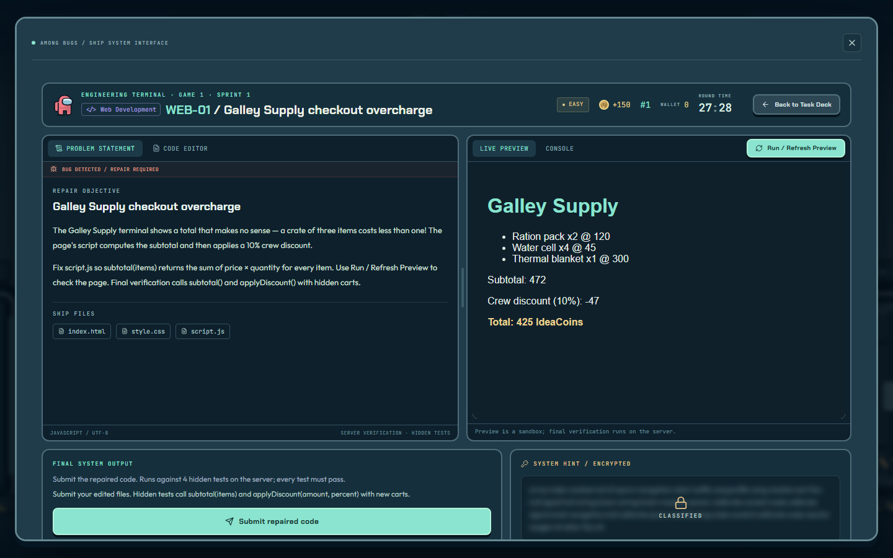
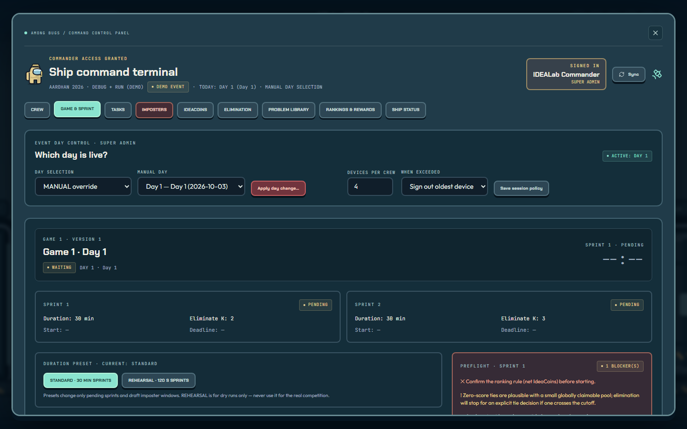
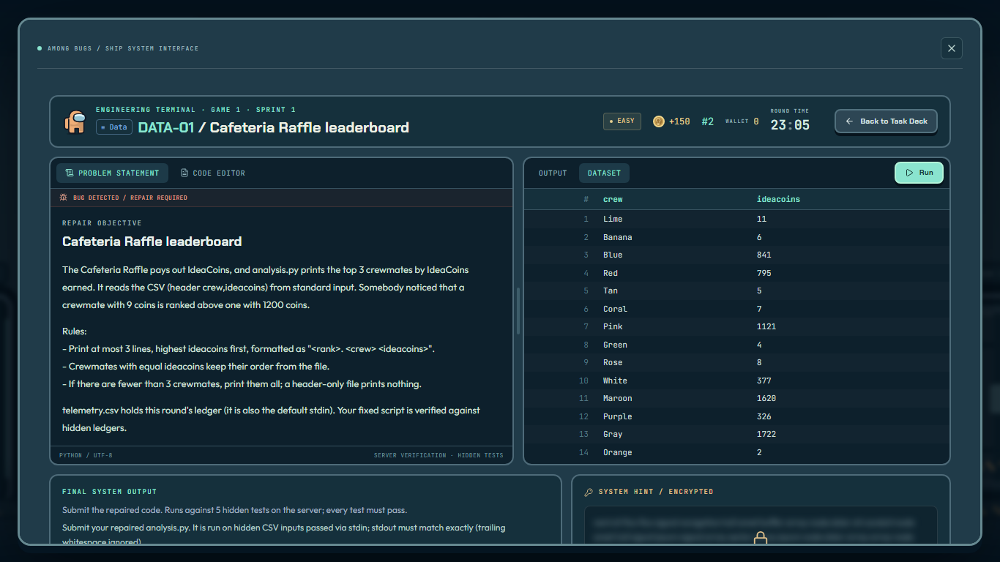

# DEBUG + RUN / AMONG BUGS

A full-stack, Among-Us-themed debugging competition platform for **IDEALab.h, SGSITS Indore —
AAROHAN 2026**. Crews register, get approved for a competition day, board an explorable spaceship,
repair buggy programs at six task stations, and race for IdeaCoins. Commanders run the event from
a card-swipe-protected command console.

| Landing | Ship lobby | Engineering terminal |
|---|---|---|
|  |  |  |
| **Command console** | **Game & sprint control** | **Data workspace** |
|  |  |  |

## What is in this repository

| Part | Stack | Purpose |
|---|---|---|
| `web/` | React 19, TypeScript, Vite, Tailwind v4, motion, Monaco (bundled locally), Socket.IO client | Landing / registration / login, access card, playable ship (WASD / E / scroll / click / touch), HUD, task workspaces, card-swipe gate, command console |
| `server/` | Node 20+, TypeScript, Fastify 5, PostgreSQL (`pg`), Socket.IO, zod | Auth & sessions, registration, eligibility, competition engine (first-solve transactions, paid hints, imposters), sprint lifecycle, elimination & results, ledger, outbox realtime, admin API, durable worker |
| `runner/` | Node HTTP service + CPython | Isolated execution of participant JavaScript / Python with hard limits; the scoring API never spawns processes |
| `server/src/content/` | TypeScript templates | 30 reviewed regular task templates × 4 variants (120 tasks) + 4 imposter templates, all self-verified |
| `docs/` | | Runbook, API contract, decisions / provisional rules, content review, developer-only demo access |

### UI source and fidelity

The organizer's published Figma Make site (`silk-bird-25541875.figma.site`) was the visual
reference. No source export was supplied, so the published production bundle was downloaded and
**decompiled back to JSX** (`docs/figma-reference-decompiled.jsx`). The crewmate, ship rooms,
stations, doors, HUD, access card, palette (`#8ae4cf` mint, `#0a121b` ink, cream headings, amber
accents), fonts (Chakra Petch / Outfit / JetBrains Mono) and keyframes were ported from it into
typed React components with real data. This is a faithful reconstruction from the published build,
not the original Figma project files. The decorative crewmates in the lobby are not live presence.

## Quick start — local, no Docker (Windows / macOS / Linux)

Requirements: **Node 20.11+** (tested on 24.12) and **Python 3.10+** on `PATH` (tested on 3.12)
for Python tasks. PostgreSQL is downloaded automatically (embedded-postgres, real PostgreSQL 18 binaries).

```bash
npm install
cp .env.example .env          # demo defaults: DEMO_MODE=true, local DB on :54329
npm run build -w runner       # once (the content check and tests use the compiled runner)
npm run dev                   # starts PostgreSQL, runner, API, worker and web; seeds the demo
```

Open **http://127.0.0.1:5173**. `npm run dev -- --no-db` uses an existing `DATABASE_URL`;
`--no-web` skips Vite. Stop with Ctrl+C (the whole process tree is stopped).

### Demo logins (demo database only)

| Who | Login | Password |
|---|---|---|
| Commander (SUPER_ADMIN) | `admin@crm.local` | `idealab` |
| Public demo crew NEXORA (CRW-042, both days) | `nexora@example.test` | `CrewDemo123!` |
| Other 19 crews, 5 of them pending | see [`docs/DEMO_ACCESS.md`](docs/DEMO_ACCESS.md) | |

The demo starts in **WAITING** with Day 1 selected. Nothing runs until a commander acts.

## Live link (public URL from your laptop, no account needed)

```powershell
# one time: download cloudflared into tools/
mkdir tools
curl.exe -L -o tools\cloudflared.exe https://github.com/cloudflare/cloudflared/releases/latest/download/cloudflared-windows-amd64.exe

# every time
npm run live
```

`npm run live` builds the web app, serves app and API together on port 4000, and opens a
Cloudflare quick tunnel. It prints `AMONG BUGS IS LIVE -> https://<random>.trycloudflare.com`.
The link works while that terminal stays open; Ctrl+C stops everything.
A new random URL is issued each run. Quick tunnels are meant for demos and rehearsals; for the
event, use a named tunnel or a proper host. The demo accounts are public knowledge, so keep the
link private or reset the passwords before sharing it widely.

## Quick start — Docker Compose

```bash
cp .env.example .env    # set RUNNER_TOKEN, GRADING_SECRET (random, ≥32 chars); NODE_ENV=production for real use
docker compose up -d --build
# demo fixture (only with DEMO_MODE=true in .env):
docker compose run --rm api node server/dist/scripts/seed-demo.js
# real event instead: bootstrap your own admin + event skeleton (no demo accounts):
docker compose run --rm -e ADMIN_BOOTSTRAP_EMAIL=you@org -e ADMIN_BOOTSTRAP_PASSWORD='…' api node server/dist/scripts/bootstrap.js
```

Open **http://localhost:4000**. In production the API serves the built web app under a strict CSP.

Services:

| Service | Image / config |
|---|---|
| `db` | PostgreSQL 17, persistent `pgdata` volume |
| `runner` | non-root, read-only root fs, tmpfs, `cap_drop: ALL`, pids / memory / CPU caps, **internal-only network** with no egress |
| `api` | Fastify + Socket.IO + web |
| `worker` | deadlines, imposter expiry, heartbeat |

> The Docker files were written and reviewed, but **Docker is not installed on the machine this
> was built on, so `docker compose up` has not been executed here**. Everything else below was
> run for real. Validate the compose stack once on the venue machine.

## Commands

| Task | Command |
|---|---|
| Install | `npm install` |
| Build everything | `npm run build` (runner, server, web) |
| Typecheck | `npm run typecheck` |
| Migrate | `npm run migrate` |
| Seed demo (idempotent; refuses unless `DEMO_MODE=true`) | `npm run seed:demo` |
| Reset demo DB (explicit, destructive) | `npm run reset:demo -- --yes` |
| Production bootstrap (no demo data) | `npm run bootstrap` with `ADMIN_BOOTSTRAP_*` env |
| Backend integration tests (real PostgreSQL + runner) | `npm test` |
| UI end-to-end tests (needs `npm run dev` running) | `npm run test:e2e` |
| Content self-check (all variants) | `npm run content:check` |
| Opt-in load / rehearsal simulator | `npm run rehearsal:sim -- --yes --crews 100 --sessions 4 --duration 120 --think 8 [--start]` |
| Production CSP check | run the API with `WEB_DIST_DIR=web/dist`, then `E2E_BASE=http://127.0.0.1:4000 node e2e/tools/csp-check.mjs` |

## Event flow (what a rehearsal looks like)

1. **Commander** signs in (Commander Login) → command card → *Enter ship* → walks to the command
   control panel (or uses the Stations menu) → **swipes the card**. The server authorises the
   session and the console opens. `/command` is the direct, low-power route to the same console.
2. **Crew management:** tick **Active Day 1 / Active Day 2** (bulk actions preview first).
   Self-registered crews start pending.
3. **Game & Sprint:** confirm the ranking rule, check durations or apply the REHEARSAL preset, set the
   elimination counts (preflight shows "10 active → eliminate 2 → 8 survive"), then **Start Sprint 1**.
4. Crews open stations, repair code, verify (server-judged), buy hints, and react to **IMPOSTER DETECTED**.
5. The timer ends, the worker closes the sprint at the authoritative deadline, and standings freeze.
   Every device shows *checking crew status*.
6. **Elimination:** review the bottom K from the frozen standings and resolve any cutoff tie
   explicitly → confirm. Ejected crews see the ejection and become read-only; survivors wait.
7. **Activate Sprint 2** manually → close → eliminate → **Results** (prize-place ties need a
   decision) → confirm. Every crew sees the podium.
8. Switch the event day. **Game 2** is independent: fresh wallets, tasks, eligibility and prizes.

## Verified in this build (actually run)

| Check | Result |
|---|---|
| `npm test`: 29 integration tests in 6 files against real PostgreSQL 18 + the real runner | **29 / 29 pass** |
| `npm run test:e2e`: 4 browser tests (Chromium) against the live stack | **4 / 4 pass** |
| `npm run content:check`: buggy starters fail, solutions pass, variants distinct | **136 variants, 0 problems** |
| `npm run typecheck`, `npm run build` (runner, server, web) | **pass** |
| Production mode: API serving the built web app under strict CSP | Monaco + sandboxed preview render, **0 CSP violations** |
| `npm audit` | **0 vulnerabilities** (dompurify pinned to a patched version) |

The integration tests cover the release gates:

- **Demo commander:** the exact credentials work, a wrong password fails, and the hash is scrypt.
- **Commander access cannot be faked:** crews can't select or forge the commander role; the swipe
  returns 403 for crews; every admin route returns 403 to crews.
- **Requests:** CSRF header and origin are enforced. Login, refresh and logout restore or revoke
  the server session; forged cookies fail.
- **Registration flow:** 4-member registration → pending → admin enables Day 1 → the same session
  reaches the Day 1 lobby → the Day 2 switch is denied with the exact message.
- **Registration safety:** roster sizes 2 and 5, weak passwords and unknown fields create no
  records. Concurrent duplicate email / team-name races create exactly one team. Same-key retries
  return the same crew ID. Passwords never appear in the audit log or idempotency records.
- **First solve:** tasks are locked shells before release (no titles or statements). Two crews
  open the same task, a wrong answer keeps it open, and concurrent correct submissions yield
  exactly one award and one credit. The loser gets *"This problem has already been solved by
  another crew. Move on to the next task."*
- **No double credit:** duplicate or concurrent same-key submits and lost-response retries credit once.
- **Real execution:** real Python and JavaScript output, real `SyntaxError` / `ReferenceError`;
  Run never changes the wallet.
- **Paid hints:**
  - Hint text is absent from detail, snapshot and list before purchase.
  - An insufficient balance is rejected without going negative.
  - A crew that earned coins buys a hint: three concurrent purchases produce one debit.
  - A second device sees the hint; other crews don't.
  - Buying on a solved task is denied with no charge.
  - Net score drops by the hint cost.
- **Ledger:** the append-only ledger reconciles with wallets; UPDATE and DELETE are rejected by triggers.
- **Imposters:**
  - Hidden before release; the first of four concurrent reservations wins.
  - The statement is owner-only.
  - Exclusive mode is enforced on the owner's second device.
  - Timeout expires with no late award, and regular mode is restored.
  - Re-arm creates generation 2; concurrent correct submits award once.
- **Sprint lifecycle:**
  - Pause and resume shift the deadline, and scoring is refused while paused.
  - Repeated clicks with a stale version are rejected.
  - The timer closes the sprint; late submits are rejected.
  - Standings are frozen: post-freeze adjustments don't change the preview.
  - A zero-score tie across the cutoff requires a decision; double confirmation is rejected.
  - No automatic Sprint 2. Ejected crews can't submit, fetch tasks or run code. Wallets carry into Sprint 2.
- **Live eligibility:** disabling Day 1 mid-game blocks the existing session's APIs immediately,
  and Day 2 eligibility is untouched.
- **Full two-game rehearsal:** Game 1 goes S1 → eliminate → S2 → eliminate → results, then the
  Day 2 switch. Day-1-only crews are denied. Game 2 starts with a fresh wallet and has no shared
  problem versions with Game 1. There are separate result rows, Game 1 history is unchanged,
  and there's no cross-game ledger contamination. The results CSV exports correctly.
- **Realtime:**
  - Unauthenticated sockets are refused.
  - Solves broadcast after commit, with no answers or hints in the payload.
  - Disabling eligibility unsubscribes the crew's socket from game events.
  - Logout disconnects the socket.
- **Persistence:** stopping and restarting the API and PostgreSQL on the same data directory keeps
  registrations, balances, hint purchases, the same browser session and the exact deadline.
  Re-running the seed changes nothing.

UI tests cover:

- registration in the browser → pending screen → commander ticks *Active Day 1* in the console → the crew boards;
- a crew swipe is **denied**: the reader closes, the crew is back in the lobby, and no `/api/admin/*` request was made;
- `/command` with a crew session shows the denial;
- a commander swipe is **granted** and the console shows all nine sections;
- typing `wasd…` in a workspace never moves the crewmate;
- the statement / editor and preview / console panels sit side by side at laptop width.

Manual browser passes also covered:

- web, data, data-structures and misc workspaces;
- a real fix in Monaco → preview refresh → server-verified *TASK COMPLETE*;
- the rankings room;
- a 390 px phone layout.

## Measured performance (rehearsal simulator, this machine)

Setup: one laptop (Intel i5-13420H, 12 logical CPUs, 16 GB) running PostgreSQL, one API process,
the worker and the runner (4 concurrent jobs) together. **100 crews × 4 sessions = 400 sessions**,
120 s, each device acting every ~8 s. Command:

```bash
npm run rehearsal:sim -- --yes --crews 100 --sessions 4 --duration 120 --think 8 --start
```

| Operation | count | p50 | p95 |
|---|---|---|---|
| state snapshot | 6024 | 19 ms | **424 ms** |
| open task | 390 | 21 ms | 1232 ms |
| hint purchase | 185 | 28 ms | 870 ms |
| wrong submission (incl. runner judging for code tasks) | 165 | 324 ms | 1422 ms |
| correct submission (judged against hidden tests) | 35 | 1182 ms | 2621 ms |
| solve → `task.solved` received by another client (end to end, incl. judging) | 30 | 1162 ms | 2390 ms |
| run (13 of 52 got an honest 503 *runner busy*) | 52 | 254 ms | 1519 ms |
| login burst (400 sign-ins in the same second; scrypt) | 400 | 7.2 s | 14.3 s |

How these compare with the proposed targets:

- **Snapshots and typed answers** meet the targets (under 1 s).
- **Code submissions** are dominated by runner judging. They need more runner capacity
  (`RUNNER_MAX_CONCURRENCY`, more CPU, or a separate runner host) to reach p95 under 1 s.
- **Standings propagation** itself is fast; the 2.4 s p95 above includes judging.
- **Logins** are only slow when all 400 arrive in the same second. `UV_THREADPOOL_SIZE=8` is now
  set to widen hashing parallelism (not re-measured).

An earlier, harsher run (~4 s think time, no snapshot cache) gave a 21.7 s p95 for snapshots.
It led to the version-keyed shared-state cache, which serves identical, never-stale data.

These are rehearsal numbers on a laptop, not a capacity guarantee. Re-run the simulator on the
venue hardware. The simulator creates real "SIM" crews: run it on a rehearsal database, then
`npm run reset:demo -- --yes`.

## Security model (summary)

- **Sessions and requests:**
  - Server sessions use random tokens stored as SHA-256, in HttpOnly / `SameSite=Lax` (`Secure` in
    production) cookies, with idle and absolute expiry and revocation (logout, reset, archive, admin).
  - CSRF protection uses a custom header plus an Origin allow-list.
  - Passwords use scrypt (N = 2¹⁵) with a dummy hash for unknown accounts.
- **Authorization:**
  - Roles are `SUPER_ADMIN`, `OPERATOR` and `CONTENT_EDITOR`, enforced on every admin route,
    export and socket room.
  - Day eligibility is checked on every game request and socket subscription.
  - The day comes from server config (Asia/Kolkata), never the browser.
- **Scoring integrity:**
  - First-solve, hint, imposter and elimination transactions lock rows in a consistent order:
    game, sprint, enrollment, task.
  - Unique constraints back every single-award rule.
  - Idempotency keys make every scoring mutation safe to retry.
  - The deadline is checked with the DB clock under lock.
- **Answers and hints:**
  - Exact-text answers are stored only as HMAC verifiers.
  - Hints and solutions never leave the server before purchase / for participants.
- **Code isolation:**
  - The web preview runs in an `iframe sandbox="allow-scripts"` (no same-origin), served with
    `connect-src 'none'`.
  - The runner is a separate non-root service: Node permission model, Python `-I`, time / output /
    size caps, and an internal-only network.
- **Exports and audit:** CSV exports escape formula injection. The ledger and audit log are
  append-only by trigger.

## Known limitations / what needs organizer action

- **Docker:** the compose stack was not executed here (Docker unavailable on the build machine).
- **Runner isolation:** in local non-Docker mode, Python runs only with `-I` (no OS sandbox); use
  the Docker runner for the event. Node jobs use Node's permission model in both modes.
- **Provisional rules** in [`docs/DECISIONS.md`](docs/DECISIONS.md) need confirmation. These
  include the real elimination counts for the real roster, durations, prizes, score basis,
  imposter rules and session policy.
- **Content:** all 120 tasks and 16 imposter variants are demo content. Review them per
  [`docs/CONTENT_REVIEW.md`](docs/CONTENT_REVIEW.md).
- **Scaling:** rate limiting is in-process; use one API instance, or move limits to Redis for
  several. The runner is the throughput bottleneck for code-judged tasks; benchmark on the venue
  hardware.
- **Logos:** institutional logos were not supplied. The IDEA LAB mark is text plus an icon, easy
  to swap in `web/src/components/ui.tsx`.
- **Admin API gaps:**
  - Member and email details can't be edited after registration.
  - Problems can't be archived via the API.
  - Ledger and audit views show the latest 500 / 150 rows.

See also: [`docs/RUNBOOK.md`](docs/RUNBOOK.md) (event-day operations, outages, backups) ·
[`docs/API.md`](docs/API.md) (endpoints, error codes, realtime topics).
